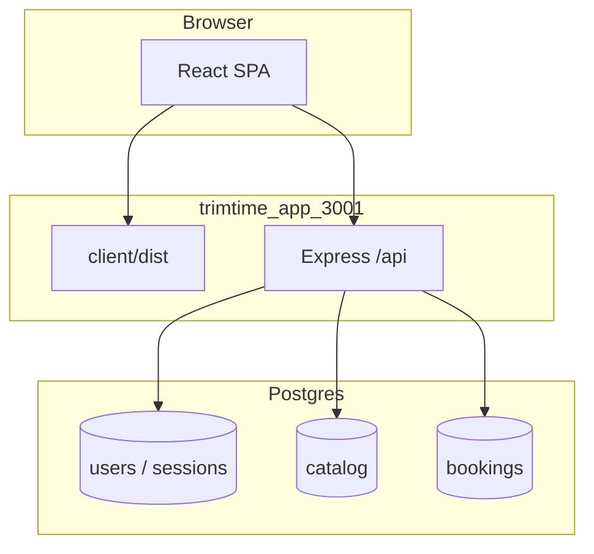
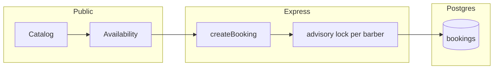
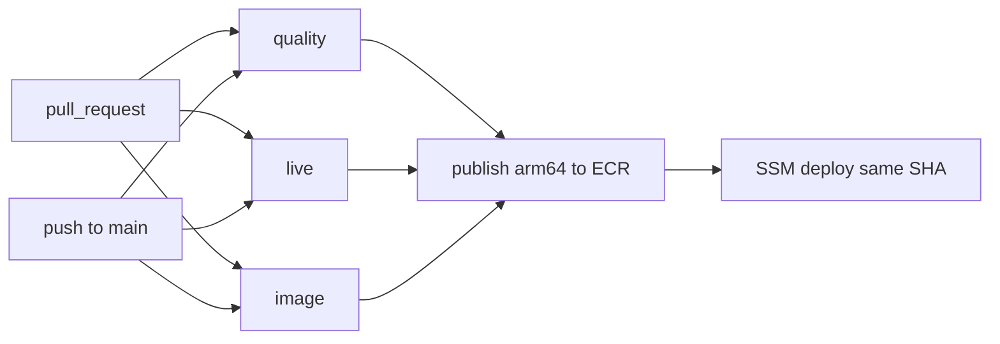
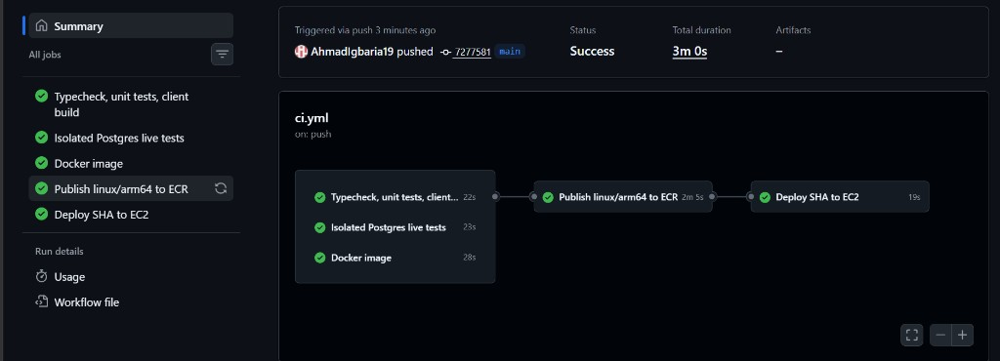
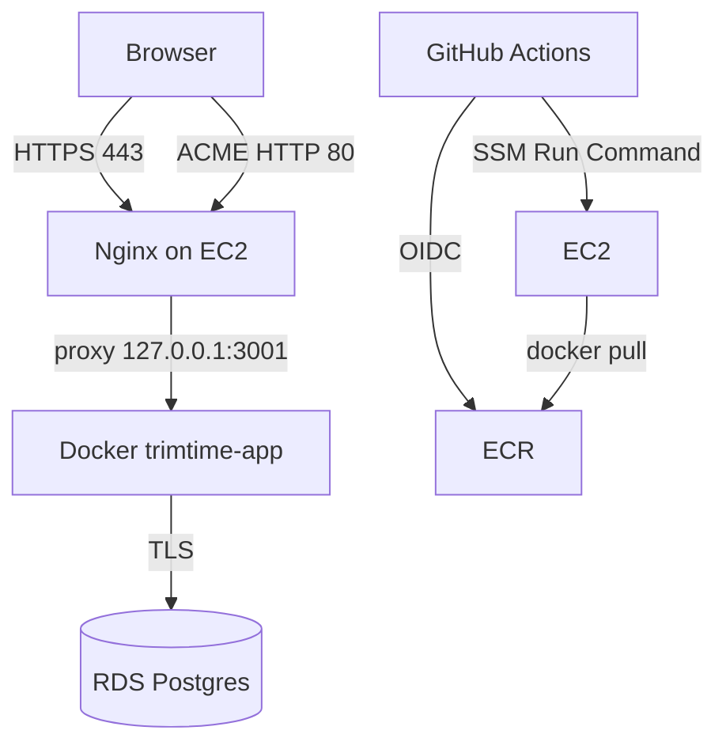

# TrimTime

A single-salon booking product: public catalog, timed slots, customer appointments, and an owner desk. The same codebase runs in Docker on a laptop and on AWS behind Nginx and HTTPS.

**Live:** [https://lamsabarber.com](https://lamsabarber.com) — HTTP and `www` redirect here.

The shop on the site is **LAMSA**. The repository is **TrimTime**. Chrome is black and gold. The UI language is English, Arabic, or Hebrew (switch in the header; no reload). Kubernetes is out of scope.

<p align="center">
  
</p>
<p align="center"><em>Live home — HTTPS, demo banner, and English / العربية / עברית in the header.</em></p>

## Contents

- [Why this project](#why-this-project)
- [Product tour](#product-tour)
- [How the site works](#how-the-site-works)
- [How a booking is protected](#how-a-booking-is-protected)
- [Stack](#stack)
- [Run locally](#run-locally)
- [Tests](#tests)
- [DevOps](#devops)
- [What works](#what-works)
- [Limits](#limits)
- [Git](#git)

## Why this project

Most booking demos stop at a form. This one has to survive two people taking the same chair, an unanswered request that reaches the start time, a walk-in with no login, and a catalog price change that must not rewrite last week’s receipt.

The same product is what runs in production: one Docker image, GitHub Actions, Terraform for AWS, Ansible and SSM on the instance, and Let’s Encrypt on the domain. [`ROADMAP.md`](ROADMAP.md) is the phase log. This file is what runs now.

## Product tour

### Public salon

Guests read the catalog without an account. Duration is inventory: a 30-minute cut and a 40-minute fade never share the same slot grid.

| Home | Services |
| --- | --- |
|  |  |

**Home.** Location, headline, book or read the menu. The gold bar is literal: demo salon, no payment. The language switch changes chrome and direction immediately. Names the salon typed in Settings stay as stored.

**Services.** Duration and shekel price sit on the card before the name.

| Barbers | Hours |
| --- | --- |
|  |  |

**Barbers.** Three chairs. Availability is per barber, not a shared pool.

**Hours.** Closed days render in red. Address and phone sit next to the week so the public page is enough to decide whether to book.

### Sign in

<p align="center">
  
</p>
<p align="center"><em>One login for both roles. Public register always creates a <strong>customer</strong>. The owner account is seeded from environment values, not from the register form.</em></p>

Phones are stored as E.164 (`+972`). There is no password-reset mail.

### Customer — book and follow up

A signed-in customer cannot open admin routes. They get **Book an appointment** and **My Bookings**.

<p align="center">
  
</p>
<p align="center"><em>Service, barber, day. The grid is hours, breaks, closes, and existing Pending or Confirmed visits. Request this time creates a <strong>Pending</strong> hold.</em></p>

<p align="center">
  
</p>
<p align="center"><em>My Bookings highlights the next visit. Cancelling <strong>Confirmed</strong> uses the salon notice window (default 2 hours). <strong>Pending</strong> can be withdrawn until start.</em></p>

### Owner desk

An admin who opens `/book` or `/bookings` is sent to the desk. An admin account cannot create a personal customer booking.

<p align="center">
  
</p>
<p align="center"><em>Remaining today, completed today, pending on any day, next confirmed visits.</em></p>

<p align="center">
  
</p>
<p align="center"><em>Day schedule: calendar, barber and status filters, start–end, customer, phone, service, Complete / No-show / Cancel.</em></p>

<p align="center">
  
</p>
<p align="center"><em>Walk-in: name, phone, optional note on the row. No user is created. The number is not attached to an existing account. It never appears on My Bookings.</em></p>

<p align="center">
  
</p>
<p align="center"><em>Salon, services, barbers, hours. Editing the menu later does not rewrite snapshots on bookings already stored.</em></p>

## How the site works

One Node process serves the Vite SPA and `/api` on port **3001**. The browser talks to the same origin, so the session cookie stays first-party. There is no separate public API host.



**Roles.** Public register always creates a `customer`. The owner is seeded from `ADMIN_*`. Customers get Book and My Bookings. Admin APIs require an admin session. Customer booking routes refuse admin accounts.

**Session.** Login sets `trimtime_session` (httpOnly, SameSite=Lax). On HTTPS the cookie is `Secure` when `COOKIE_SECURE=true`.

**Catalog vs receipt.** The public menu is live rows. A booking stores service name, barber name, price, and duration at write time.

**Who owns a visit.** A signed-in booking sets `customer_id`. A desk walk-in stores `guest_name` / `guest_phone` and leaves `customer_id` null.

**Availability.** `GET /api/availability` builds slots from hours, breaks, one-time closes, and Pending/Confirmed intervals. Days stay inside the booking horizon (`Asia/Jerusalem`).

**Languages.** Copy lives in `client/src/i18n/messages.ts`. The choice is in `localStorage`. Arabic and Hebrew set `dir=rtl` on `<html>` without a reload.

## How a booking is protected

Two customers must not sit in the same chair. There is no Postgres `EXCLUDE` on time ranges. The product does this:

1. **`getAvailability`** loads Pending/Confirmed intervals for that barber and subtracts them from working hours.
2. **`createBooking`** takes `pg_advisory_xact_lock(871001, barberId)`, asks availability again, and inserts only if the start is still free.
3. A second concurrent request waits on the lock, then receives 409 `That time is no longer available.`



```text
Pending ──confirm──► Confirmed ──complete──► Completed
    │                     │
    │reject               │salon or customer cancel
    ▼                     ▼
 Expired / Rejected     Cancelled
```

Unanswered **Pending** becomes **Expired** at appointment start (process boot + a 15s loop), not only when someone opens the admin page.

## Stack

| Piece | Local | Production (`eu-central-1`) |
| --- | --- | --- |
| App (Vite + Express) | Docker `trimtime-app` → `127.0.0.1:3001` | Same image on EC2 `t4g.small` (linux/arm64), loopback `:3001` |
| Edge | — | Nginx `:80` / `:443`, Let’s Encrypt, HTTP and `www` → `https://lamsabarber.com` |
| PostgreSQL 16 | Docker, `127.0.0.1:5434`, volume `trimtime_pgdata` | RDS `db.t4g.micro` Single-AZ, private subnet, TLS |
| Secrets | Host `.env` (not in the image) | SSM Parameter Store SecureString; RDS master in Secrets Manager (not used by Node) |

Do not bind this stack to port **3000**.

```
TirmTimeProject/
  client/                    SPA, i18n
  server/                    API, migrations, unit + isolated live tests
  Dockerfile                 Multi-stage Node 22 image (SPA + API)
  docker-compose.yml         Local app + Postgres
  .github/workflows/cicd.yml Checks, then publish + deploy on main
  .github/scripts/           SSM deploy helper
  infra/terraform/           VPC, EC2, RDS, ECR, OIDC
  infra/ansible/             Nginx, certbot, Compose, fetch-env, deploy/rollback
  docs/screenshots/          Product tour and a green pipeline run
  docs/aws-design.md         Architecture and cost notes
  ROADMAP.md                 Phase log
```

## Run locally

**Prerequisites:** Docker Desktop. Node.js is only needed for `npm test` / `npm run test:live` or optional host-based `npm run dev`.

```bash
cp .env.example .env
npm run up
```

`npm run up` is `docker compose up -d --build --wait`. It does not delete volume `trimtime_pgdata`. Never add `-v` to `docker compose down`.

On API startup: migrations, seed the salon if empty, seed admin from `.env` if that phone is unused. The live shop name **LAMSA** was set in Settings after first seed.

- Site: `http://127.0.0.1:3001`
- Health: `http://127.0.0.1:3001/api/health`

Postgres stays on `127.0.0.1:5434` for host-side tests.

Optional host Vite + API: stop `trimtime-app` first so port **3001** is free, then `npm install` and `npm run dev` (client `3001`, API `4000`). `npm run db:migrate` applies migrations without starting HTTP.

## Tests

Mutating tests must not use the live salon database. `npm run test:live` creates and resets `trimtime_test` and refuses to run unless that is the database name.

```bash
npm test
npm run test:live
```

Last local result (2026-09-09): **20** unit tests; **13** isolated live tests (overlap race, idempotency, isolation, snapshots, restart, Expired, guest row, salon cancel). Live `trimtime` was unchanged.

## DevOps

Laptop and live use the **same Dockerfile**. What changes is the database, the edge, and who starts the container.

### Docker

Two stages: `npm ci` + `vite build`, then a runtime image that copies `client/dist` and starts Express. Compose locally runs app + Postgres. The image does not contain `.env`.

On AWS the app is still one Compose service. Postgres is RDS. The EC2 Compose file is [`infra/ansible/templates/compose.yml.j2`](infra/ansible/templates/compose.yml.j2).

### CI/CD

One workflow: [`.github/workflows/cicd.yml`](.github/workflows/cicd.yml). Jobs never read the laptop `.env`. GitHub assumes the AWS role with **OIDC** ([`infra/terraform/github_oidc.tf`](infra/terraform/github_oidc.tf)). There are no long-lived AWS access keys in the repository.

**Pull request** — three jobs only. No ECR push, no deploy.

| Job | What it runs |
| --- | --- |
| `quality` | Client `tsc`, unit tests, `vite build` |
| `live` | `npm run test:live` on a GitHub-hosted Postgres 16 (not `trimtime_pgdata`) |
| `image` | `docker build` on `ubuntu-latest` (**linux/amd64** — smoke only, never deployed) |

**Push to `main`** — the same three jobs, then:

| Job | What it runs |
| --- | --- |
| `publish` | After the three succeed: `docker buildx --platform linux/arm64` of **that commit**, tag = full git SHA, push to ECR |
| `deploy` | After `publish`: SSM `trimtime-deploy` of the **same SHA** on the TrimTime EC2, then `curl` of `https://lamsabarber.com/api/health` |



<p align="center">
  
</p>
<p align="center"><em>Push to <code>main</code>: checks, linux/arm64 publish, deploy. The site updates when this graph is green.</em></p>

If `publish` fails, `deploy` does not run. The live container stays on the previous SHA.

The `deploy` job names the GitHub Environment `production` (concurrency group `production-deploy`). That name is in the workflow file. A required-reviewer gate was **not** observed: pushes to `main` publish and deploy when the jobs succeed, with no wait-for-approval step.

Image rollback does not undo SQL. Migrations are forward-only. [`trimtime-rollback`](infra/ansible/templates/trimtime-rollback.sh.j2) restarts the previous image SHA; it is not wired as an automatic job.

### AWS

Region **`eu-central-1`**. No ALB, no NAT Gateway, no Kubernetes.

| Resource | Shape | Role |
| --- | --- | --- |
| VPC | `10.0.0.0/16` | One public subnet (EC2) + two private (RDS subnet group) |
| EC2 | `t4g.small` Graviton, Ubuntu, Elastic IP | Nginx, Docker, SSM Agent |
| RDS | PostgreSQL 16, `db.t4g.micro`, Single-AZ, not public | Salon data |
| ECR | Private repository | linux/arm64 images tagged with the git SHA |
| SSM Parameter Store | SecureString under `/trimtime/prod/app/*` | App DB user, session secret, admin seed |
| Secrets Manager | One RDS-managed secret | Master password (bootstrap only) |



DNS is Namecheap BasicDNS: A records for `@` and `www` to the Elastic IP. Nginx + certbot issue a Let’s Encrypt certificate for both names. `certbot.timer` renews (HTTP-01, webroot). Ansible keeps that layout so a later playbook run does not wipe HTTPS.

The instance reaches RDS on the private network with TLS. Postgres is not opened to the internet.

### Terraform and Ansible

**Terraform** (`infra/terraform/`) creates VPC, subnets, security groups, EC2, EIP, RDS, ECR, the instance profile, and the GitHub OIDC role. State is in S3 with a native lock file (Terraform ≥ 1.11). GitHub Actions does not run `terraform apply` on each push.

**Ansible** (`infra/ansible/`) installs packages, the Nginx site, certbot, the RDS CA bundle, Compose, `trimtime-fetch-env` (SSM → `/etc/trimtime/app.env`), `trimtime-deploy`, and `trimtime-rollback`. Day-to-day deploys are SSM, not a laptop SSH session.

Operator notes: [`infra/iam/operator-setup.md`](infra/iam/operator-setup.md). Architecture and cost: [`docs/aws-design.md`](docs/aws-design.md).

## What works

- Public catalog and availability in `Asia/Jerusalem`
- Customer register / login (public register is always `customer`)
- Book → **Pending**; My Bookings; cancel with notice on **Confirmed**
- Admin dashboard, manage bookings, settings
- Role split on the API, not only in the UI
- Complete / No-show only from appointment start
- Pending with no reply → **Expired** at start
- Desk booking: existing customer or visitor name/phone on the row
- Salon cancel of Confirmed with actor and reason
- Overlap control: availability + advisory lock
- Snapshots of price, duration, and names
- English / Arabic / Hebrew (RTL, no reload)
- One image for laptop and AWS
- Push to `main`: checks → linux/arm64 ECR → SSM deploy → public health
- Live site [https://lamsabarber.com](https://lamsabarber.com)

## Limits

- Demo: no payments, no SMS
- Guest rows are not linked to accounts, even if the phone matches
- RDS is Single-AZ
- `/api/health` means the Node process answered; it does not query Postgres
- Image rollback does not reverse migrations
- No CloudWatch dashboard or paging alert
- Automated RDS backups are configured (7 days in Terraform). A restore onto a **separate** instance has not been drilled on this account
- `test:live` needs Node on the host and wipes `trimtime_test` at the start of each run
- Do not run host `npm run dev` while `trimtime-app` holds port 3001

## Git

`.env`, dumps, keys, and `node_modules` are gitignored. Commit `.env.example`, screenshots, and `package-lock.json`. Do not copy `.env` into images.

Default branch: `main`. A green push there is what updates [lamsabarber.com](https://lamsabarber.com).
