# TrimTime

A single-salon booking product: public catalog, timed availability, customer appointments, and an owner desk.

The demo shop in the UI is **LAMSA** (Al-Masayef, Jerusalem). The repository is **TrimTime** — a CV / DevOps learning project. The product is English, left-to-right, black and gold. Kubernetes is out of scope.

<p align="center">
  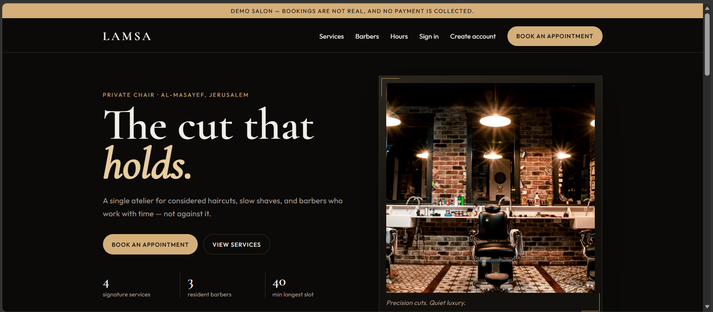
</p>
<p align="center"><em>Public home — demo banner, catalog stats, and a single call to book.</em></p>

## Contents

- [Why this project](#why-this-project)
- [Product tour](#product-tour)
- [How a booking is protected](#how-a-booking-is-protected)
- [Stack](#stack)
- [Run locally](#run-locally)
- [Tests](#tests)
- [What already works](#what-already-works)
- [Current limits](#current-limits)
- [Git](#git)
- [Next](#next)

## Why this project

Most booking demos stop at a form. This one has to survive two people clicking the same chair, an unanswered request that reaches the start time, a walk-in with no login, and a catalog price change that must not rewrite last week’s receipt.

The later DevOps work (Docker for the app, CI, AWS) is planned in [`ROADMAP.md`](ROADMAP.md). This README describes **what runs today**.

## Product tour

### Public salon

Guests see the catalog without an account. Durations are first-class: a 30-minute cut and a 40-minute fade never share the same slot grid.

| Home | Services |
| --- | --- |
|  | 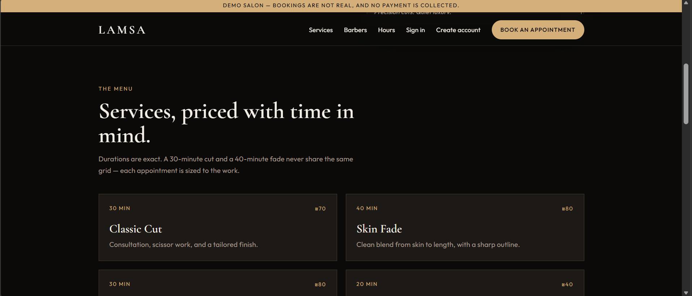 |

**Home.** Location, headline, and the two actions that matter: book, or read the menu. The gold bar is honest: this is a demo; no money is taken.

**Services.** Each card shows duration and shekel price before the name. The copy is the product rule: time is the inventory.

| Barbers | Hours |
| --- | --- |
| 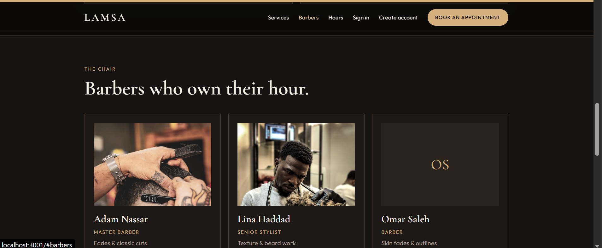 | 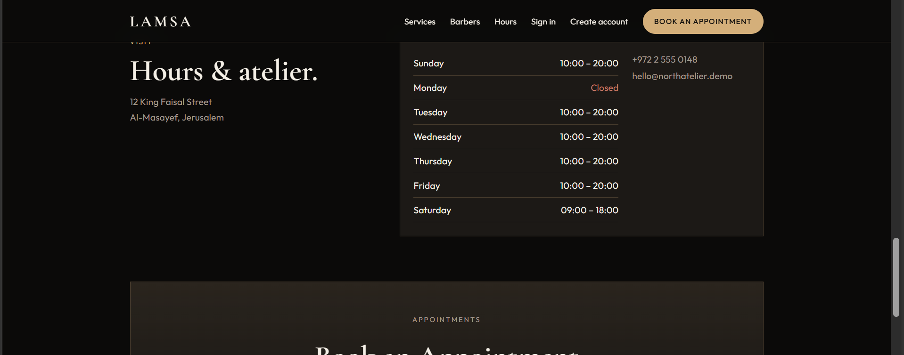 |

**Barbers.** Three chairs (Adam, Lina, Omar). Availability is per barber, not a shared pool.

**Hours.** Closed days render in red. Address and phone sit next to the week so the public page is enough to decide whether to book.

### Sign in

<p align="center">
  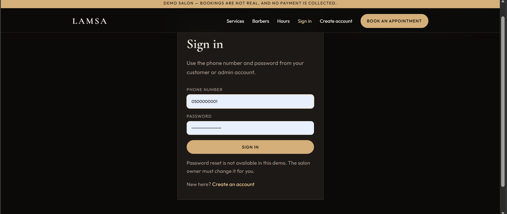
</p>
<p align="center"><em>One login for both roles. Public register always creates a <strong>customer</strong>. The salon owner is seeded from <code>.env</code>.</em></p>

Phone numbers are stored as E.164 (`+972`). There is no password-reset email in this demo.

### Customer — book and follow up

A signed-in customer cannot open admin routes. They get **Book an appointment** and **My Bookings**.

<p align="center">
  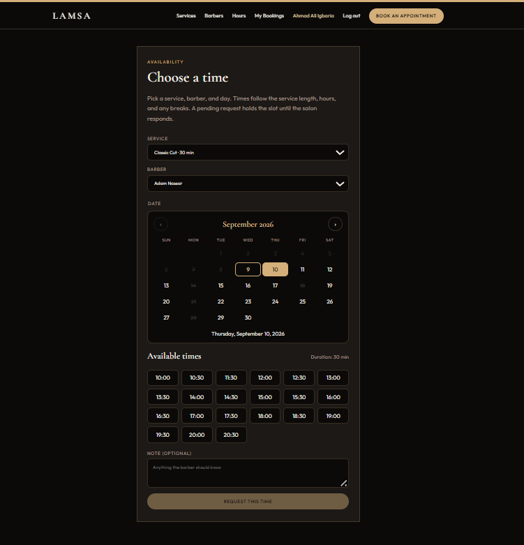
</p>
<p align="center"><em>Pick service, barber, and day. The grid is generated from hours, breaks, closes, and existing Pending/Confirmed visits. Request this time creates a <strong>Pending</strong> hold.</em></p>

<p align="center">
  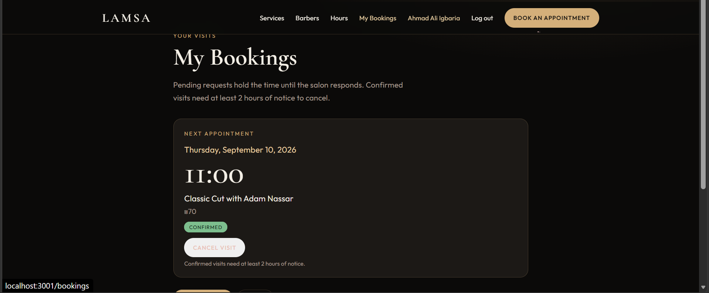
</p>
<p align="center"><em>My Bookings highlights the next visit. Confirmed cancellations need the salon notice window (default 2 hours). Pending can be withdrawn until start.</em></p>

### Owner desk

An admin landing on `/book` or `/bookings` is sent to the desk. They cannot create a personal customer booking with their admin account.

<p align="center">
  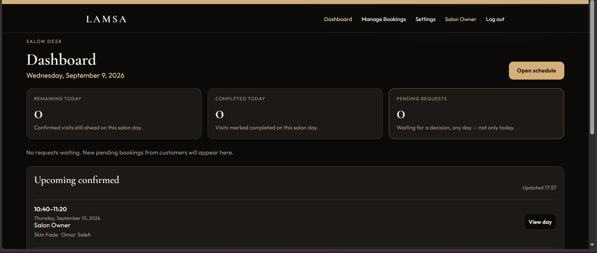
</p>
<p align="center"><em>Dashboard — remaining today, completed today, pending on any day, plus the next confirmed visits.</em></p>

<p align="center">
  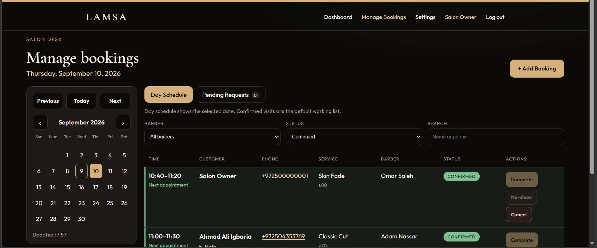
</p>
<p align="center"><em>Day schedule first: calendar, barber and status filters, start–end, customer, phone, service, actions (Complete, No-show, Cancel).</em></p>

<p align="center">
  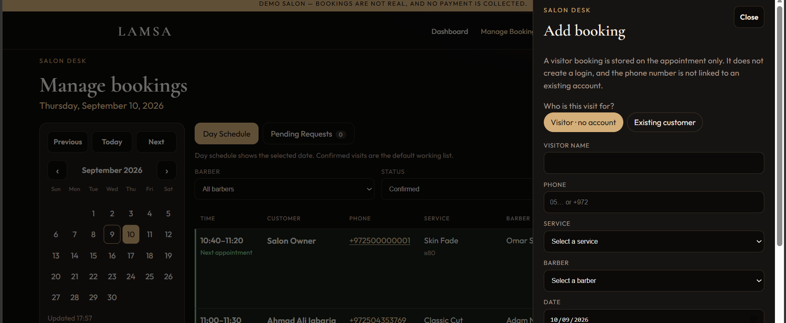
</p>
<p align="center"><em>Walk-in / phone booking: name, phone, optional note on the row. No user is created, and the number is not attached to an existing account. It never appears on anyone’s My Bookings.</em></p>

<p align="center">
  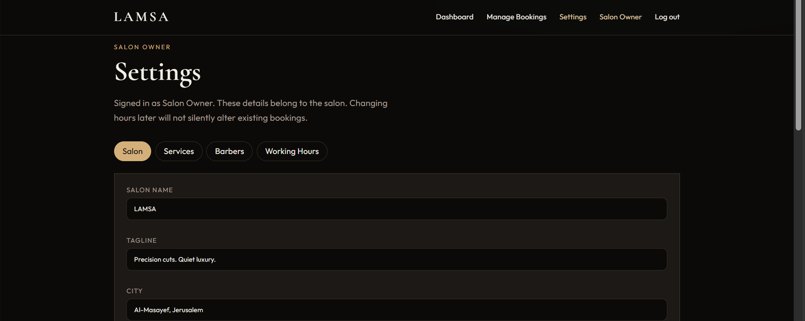
</p>
<p align="center"><em>Settings — salon, services, barbers, hours. Changing the menu later does not rewrite snapshots on bookings already stored.</em></p>

## How a booking is protected

Two customers must not sit in the same chair. There is **no** Postgres `EXCLUDE` constraint on time ranges. The product does this:

1. **`getAvailability`** loads Pending/Confirmed intervals for that barber and subtracts them from working hours (`availableLocalTimes`).
2. **`createBooking`** takes `pg_advisory_xact_lock(871001, barberId)`, asks availability again, and inserts only if the start is still in the slot list.
3. A second concurrent request waits on the lock, then sees 409 `That time is no longer available.`

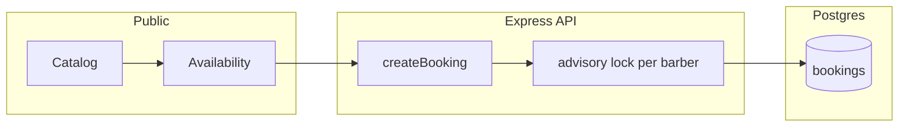

```text
Pending ──confirm──► Confirmed ──complete──► Completed
    │                     │
    │reject               │salon or customer cancel
    ▼                     ▼
 Expired / Rejected     Cancelled
```

Unanswered **Pending** becomes **Expired** at appointment start (process boot + 15s loop), not only when someone opens the admin page.

## Stack

| Piece | How it runs today |
| --- | --- |
| App (React build + Express API) | Docker, `http://127.0.0.1:3001` |
| PostgreSQL 16 | Docker, `127.0.0.1:5434`, volume `trimtime_pgdata` |

Do not bind this stack to port **3000**.

```
TirmTimeProject/
  client/                 SPA (public site, book, My Bookings, admin desk)
  server/                 API, SQL migrations, unit + isolated live tests
  docs/screenshots/       README product tour
  docs/aws-design.md      Phase 6 AWS architecture and cost
  docs/aws-next.md        TLS, arm64, and deploy work still required
  infra/                  Terraform + Ansible (local prep; no apply)
  db/init.sql             First-boot Postgres hook (tables come from migrations)
  Dockerfile              Multi-stage app image
  docker-compose.yml      App + Postgres
  ROADMAP.md              Product → Docker → CI → AWS
```

Secrets stay in the host `.env` file. Compose injects them at runtime; they are not copied into the image.

## Run locally

**Prerequisites:** Docker Desktop. Node.js is only needed for `npm test` / `npm run test:live` or optional host-based `npm run dev`.

1. Copy environment values. Never commit `.env`.

```bash
cp .env.example .env
```

2. Build and start the app + Postgres. This does **not** delete volume `trimtime_pgdata`. Never add `-v` to `docker compose down`.

```bash
npm run up
```

or:

```bash
docker compose up -d --build --wait
```

On API startup: migrations, seed the salon if empty (default name North Atelier), seed admin from `.env` if that phone is unused. The live demo shop was renamed to **LAMSA** in Settings.

- Site: `http://127.0.0.1:3001`
- Health: `http://127.0.0.1:3001/api/health`

Postgres remains published at `127.0.0.1:5434` for host-side tests.

Optional host-based Vite + API (not required to run the product). Stop the `trimtime-app` container first so port **3001** is free, then:

```bash
npm install
npm run dev
```

That layout is client `3001` + API `4000`, as before. `npm run db:migrate` applies migrations without starting the HTTP server.

## Tests

Mutating tests **must not** use the live salon database. `npm run test:live` creates/resets `trimtime_test` on the same Docker instance and refuses to run unless `PGDATABASE` is that name.

```bash
npm test        # unit tests (no live salon writes)
npm run test:live
```

Last local result (2026-09-09): **20** unit tests passed; **13** isolated live tests passed (overlap race, idempotency, isolation, snapshots, restart, Expired, guest row, salon cancel). Live `trimtime` was unchanged.

## CI

GitHub Actions (`.github/workflows/ci.yml`) runs on pull requests and on pushes to `main`. There is no ESLint yet; “lint/typecheck” is `tsc` on the client. Jobs do not read the local salon `.env`.

| Job | What it proves |
| --- | --- |
| Typecheck, unit tests, client build | TypeScript on the SPA, the 20 unit tests, and `vite build` |
| Isolated Postgres live tests | `npm run test:live` against a fresh GitHub `trimtime` / `trimtime_test` pair, never the laptop volume |
| Docker image | `docker build` of the same multi-stage Dockerfile used locally |

A red X on a pull request means that job failed. Fix the commit and push again; do not merge until all three are green.

On **`push` to `main` only**, after those three jobs succeed:

| Job | What it does |
| --- | --- |
| Publish linux/arm64 to ECR | `docker buildx --platform linux/arm64` of **that commit**, tag = full git SHA, push to ECR via **OIDC** (no AWS keys in the repo) |
| Deploy SHA to EC2 | GitHub Environment **`production`** (required reviewer) then SSM Run Command `trimtime-deploy` of the **same SHA** |

Pull requests never publish or deploy. Set repository variables `AWS_ROLE_ARN`, `EC2_INSTANCE_ID`, and `SITE_URL` after Terraform has created the OIDC role. See [`infra/iam/operator-setup.md`](infra/iam/operator-setup.md).

## What already works

- Public catalog and availability in `Asia/Jerusalem` (hours, breaks, one-time closes)
- Customer register / login (public register is always `customer`)
- Book → **Pending** hold; My Bookings; cancel with notice on **Confirmed**
- Admin dashboard, manage bookings, settings
- Role split: customers cannot call admin APIs; admin cannot use customer booking routes
- Complete / No-show from appointment start only
- Pending with no reply → **Expired** at start (boot + interval)
- Manual booking: existing customer **or** visitor name/phone on the row
- Salon cancel of Confirmed with actor + reason (not Completed / No-show)
- Overlap control via availability + advisory lock
- Snapshots of price, duration, and names on each booking

## Current limits

- Demo only: no payments, no SMS
- Guest bookings are not linked to accounts, even if the phone matches
- `test:live` still needs Node on the host and wipes `trimtime_test` at the start of each run
- Do not run host `npm run dev` while `trimtime-app` is bound to port 3001
- Proof of correctness is the API suite plus Docker health/persistence checks, not a physical-phone click-through of every screen

## Git

`.env`, dumps, keys, and `node_modules` are gitignored. Commit `.env.example`, screenshots, and `package-lock.json`. Do not copy `.env` into Docker images.

Default branch: `main`. Later work: short-lived branches and pull requests.

## Next

Local AWS files (Phase 7a) are on branch `aws-prep`. Account is open; **apply is not approved yet**. Prep notes: [`docs/aws-7b-prep.md`](docs/aws-7b-prep.md). See [`ROADMAP.md`](ROADMAP.md).
