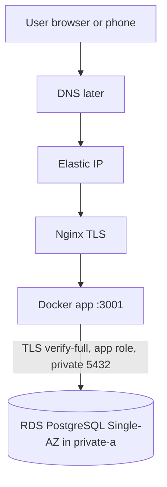
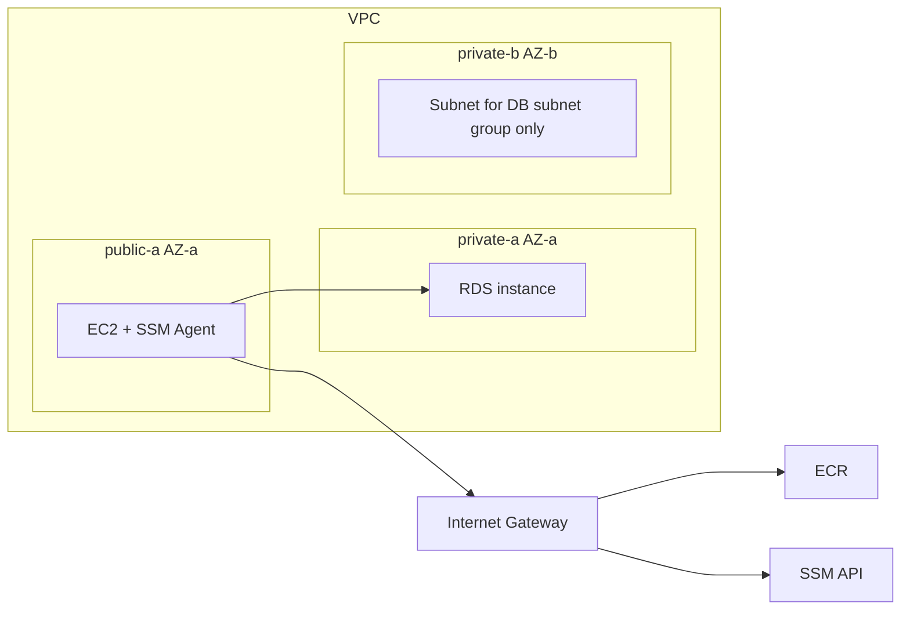

# TrimTime — AWS architecture and cost (Phase 6)

**Status:** architecture **approved for local file prep** (2026-09-10). App stack is live in `eu-central-1`. Phase 8 jobs are in `ci.yml`; OIDC IAM is **not** applied yet. No domain.

**Verification date:** 2026-09-10 (pricing re-checked 2026-09-10).

Ahmd approved Frankfurt, `t4g.small`, RDS Single-AZ in a two-AZ private DB subnet group, ECR, Terraform + Ansible, no ALB, no NAT, RDS-managed master secret in Secrets Manager, app secrets in SSM. That approval is **local preparation only**. Creating resources and deploying still need a working AWS account **and** a separate go-ahead. Local Docker, `terraform validate`, and Ansible syntax checks are not proof that this stack works on AWS.

## Current project facts (not assumptions)

| Item | Fact as of 2026-09-10 |
| --- | --- |
| Product | Single-salon booking. Express serves the Vite SPA + `/api` on **one** port (`3001` in Docker). |
| Image | Multi-stage `Dockerfile` (`node:22-alpine`). Compose runs `trimtime-app` + Postgres 16. |
| Database client today | `server/src/db/pool.ts` — `pg.Pool` with host/user/password **and no TLS options**. |
| Migrations today | `server/src/index.ts` runs `migrate()` on every process start. SQL files are apply-once (`schema_migrations`). There are **no down migrations**. |
| CI | `.github/workflows/ci.yml`: typecheck + `npm test` + client build; isolated `test:live`; `docker build` with **no `--platform`** (GitHub `ubuntu-latest` → **linux/amd64**). No registry push. |
| GitHub | Public repo [AhmadIgbaria19/TrimTime-](https://github.com/AhmadIgbaria19/TrimTime-). |
| CI on GitHub | PR [#3](https://github.com/AhmadIgbaria19/TrimTime-/pull/3) (`ci-fail-demo`): `2d762fa` **failed**; `f85c5a8` **succeeded** ([run 34489569300](https://github.com/AhmadIgbaria19/TrimTime-/actions/runs/34489569300)). PR **#3 is still open**. PR #2 was merged to `main`. |
| AWS account | Suspended (outstanding balance). **No keys in this phase. Do not create resources.** |
| Free Tier | **Not assumed.** |

Kubernetes is out of scope (`ROADMAP.md`). v1 stays **EC2 + RDS + ECR**, Terraform + Ansible, **no ALB, no NAT Gateway**.

---

## 1. Proposed architecture (right-sized)

**Region: `eu-central-1` (Europe / Frankfurt)** — commercial AWS partition (`aws`), not the EU Sovereign Cloud.

Why Frankfurt rather than `il-central-1` (Tel Aviv), without unmeasured claims:

- TrimTime is a CV/DevOps project that should use a **standard commercial Region** whose docs, AMIs, and Graviton (`t4g`) coverage are the ones most interviewers and tutorials assume. Frankfurt is that class of Region.
- The salon demo is in Jerusalem. Tel Aviv is geographically closer. **We did not measure RTT.** Latency is not the reason for Frankfurt.
- AWS documents that some RDS CA types (`rds-ca-rsa4096-g1`, `rds-ca-ecc384-g1`) are **unavailable in Israel (Tel Aviv)**; Frankfurt has the regional bundle including `rds-ca-rsa2048-g1` ([Using SSL/TLS with RDS](https://docs.aws.amazon.com/AmazonRDS/latest/UserGuide/UsingWithRDS.SSL.html)). v1 will use `rds-ca-rsa2048-g1`, which exists in both Regions — this is a footnote, not the main reason.
- **Changing Region after the first apply is a migration, not a variable flip.** New VPC, new EC2, new RDS (snapshot copy or `pg_dump`/`pg_restore`), new EIP, new certificates, rebuild or replicate ECR. `var.aws_region` is useful **before** the first apply or for a greenfield rebuild only. Israel was not chosen; v1 is Frankfurt.

**Shape:** one public EC2 running Docker + Nginx; RDS PostgreSQL **Single-AZ** in a private subnet; **DB subnet group with two private subnets in two AZs** (RDS requirement even for Single-AZ); ECR for the app image.

```text
VPC 10.0.0.0/16                         eu-central-1
─────────────────────────────────────────────────────
 public-a  10.0.0.0/24    (AZ-a)        IGW
   EC2 t4g.small + Elastic IP
   Nginx :80/:443
   Docker trimtime-app :3001
   SSM Agent (Run Command + optional Session Manager)

 private-a 10.0.10.0/24   (AZ-a)        no IGW, no NAT
   RDS PostgreSQL 16  Single-AZ  ← instance lives here
   (same AZ as EC2 to avoid cross-AZ traffic)

 private-b 10.0.11.0/24   (AZ-b)        no IGW, no NAT
   empty in v1 — required member of the DB subnet group
─────────────────────────────────────────────────────
ECR (regional)  ← EC2 pulls linux/arm64 image tagged with git SHA
SSM Parameter Store  ← app user password, session secret, admin password
Secrets Manager (1 secret)  ← RDS master password (RDS-managed; not used by the app)
```

RDS **must** have subnets in at least two Availability Zones in the Region, including Single-AZ deployments ([Working with a DB instance in a VPC](https://docs.aws.amazon.com/AmazonRDS/latest/UserGuide/USER_VPC.WorkingWithRDSInstanceinaVPC.html)). One private subnet is not a valid DB subnet group.

### Components and why

| Piece | Choice | Why |
| --- | --- | --- |
| **VPC** | New VPC, not the default VPC | Repeatable Terraform; public vs private is explicit. |
| **Subnets** | 1 public (AZ-a, EC2) + **2 private** (AZ-a and AZ-b) | RDS DB subnet group rule. Pin the **Single-AZ** instance to AZ-a with the EC2. AZ-b subnet exists for the group only. |
| **Internet Gateway** | Yes | HTTPS in; ECR, apt, Let's Encrypt, **SSM public endpoints** out. |
| **NAT Gateway** | **No** | EC2 is public; RDS has no internet need. See §3. |
| **EC2** | **t4g.small** (2 vCPU, 2 GiB, Graviton) Ubuntu ARM | Nginx + Docker + Node. `t4g.micro` (1 GiB) is too tight. |
| **CPU architecture** | ARM64 | See §7. Current CI image is amd64 and **must not** be deployed to `t4g`. |
| **EBS** | gp3, **20 GB** root | OS + Docker layers + logs. |
| **Elastic IP** | One, on EC2 | Stable address for DNS and SSH allowlisting. |
| **RDS** | PostgreSQL **16**, **db.t4g.micro**, **Single-AZ**, gp3 **20 GiB** (RDS minimum) | Managed backups. Not Multi-AZ. |
| **RDS public access** | **Disabled** | No public IP. Connect by RDS **DNS endpoint**, not a raw IP ([RDS VPC docs](https://docs.aws.amazon.com/AmazonRDS/latest/UserGuide/USER_VPC.WorkingWithRDSInstanceinaVPC.html)). |
| **RDS TLS** | `sslmode=verify-full` equivalent; regional CA bundle; `rds.force_ssl` on | See §5. Disabling verification is not a solution. |
| **ECR** | One private repository | Immutable tag = full git SHA. Same-region pull is not internet transfer in AWS’s ECR example ([ECR pricing](https://aws.amazon.com/ecr/pricing/)). |
| **ALB** | **No** | See §3. |
| **IAM (EC2 instance profile)** | Least privilege **plus SSM Agent core** | `AmazonSSMManagedInstanceCore` (or equivalent custom policy) **and** ECR pull **and** `ssm:GetParameters` on `/trimtime/prod/app/*`. Parameter Store read alone does **not** make Run Command work. See §6. |
| **IAM (later CD)** | GitHub **OIDC** | ECR push + `ssm:SendCommand` / `GetCommandInvocation` on this instance. No long-lived AWS keys in GitHub. |
| **SSH** | Port 22 from Ahmd’s `/32` until SSM Session Manager is proven | Then 22 can close. |
| **App secrets** | SSM Parameter Store **SecureString** (standard) | App DB password, `SESSION_SECRET`, `ADMIN_PASSWORD`. Standard parameters: no storage charge ([SSM pricing](https://aws.amazon.com/systems-manager/pricing/)). |
| **RDS master password** | RDS-managed (`manage_master_user_password`) in **Secrets Manager** (one secret) | Keeps the master password **out of Terraform state**. App never uses it. See §4. |

### Security groups (minimum)

| Group | Inbound | Outbound |
| --- | --- | --- |
| `sg-app` (EC2) | TCP 80 and 443 from `0.0.0.0/0`. TCP 22 from Ahmd’s IP `/32` only. | TCP 443 to the internet (ECR, Let's Encrypt, apt, **SSM / `ssmmessages` / `ec2messages`**). TCP 5432 to `sg-db`. |
| `sg-db` (RDS) | TCP 5432 **only** from `sg-app`. | None required for the product. |

RDS encryption at rest: AWS-managed key (no extra customer-managed KMS key in v1).

### What we are explicitly **not** adding

- ECS/Fargate, EKS, Auto Scaling, Multi-AZ RDS, CloudFront, WAF, ElastiCache, NAT, ALB, DynamoDB lock table.
- A second EC2 “for HA”.
- Interface VPC endpoints for SSM (optional hardening; extra cost). Public subnet + IGW + HTTPS egress is the documented alternative ([SSM VPC endpoints](https://docs.aws.amazon.com/systems-manager/latest/userguide/setup-create-vpc.html)).
- Buying a domain until this design and cost are approved.

---

## 2. Tool roles and boundaries

| Tool | Owns | Does **not** own |
| --- | --- | --- |
| **Terraform ≥ 1.11** | Cloud resources: VPC, three subnets, IGW, route tables, SGs, IAM instance profile + later OIDC role, ECR, EC2, EBS, EIP, RDS (Single-AZ in AZ-a), DB subnet group (private-a + private-b), SSM **parameter names** for app secrets if we create empty placeholders. Remote state in S3 with **`use_lockfile = true`**. | Packages on the VM, Nginx, TLS certs, Docker on the box, **secret values** for the app user, Ansible inventory facts. |
| **Ansible** | Ubuntu: Docker Engine, Nginx, Certbot, **SSM Agent running**, RDS CA bundle on disk, compose/unit that runs `…/trimtime-app:<sha>`, log rotation. | Creating VPC/RDS. Replacing Terraform. Putting passwords in playbooks. |
| **AWS CLI** | Humans: inspect, SSM get, `sts get-caller-identity`. One-time bootstrap of the state bucket if we do that by hand. | Day-to-day create/destroy (Terraform). CI credentials (OIDC). |
| **Nginx** | TLS to browsers, proxy to `127.0.0.1:3001`. | Database TLS (that is the Node `pg` client). |
| **HTTPS / Certbot** | Let's Encrypt for the future hostname. | DNS registration (**after** approval). ACM is unnecessary without an ALB. |

**CI vs CD (Phase 8, in repo 2026-09-17):** stay in **one** file [`.github/workflows/ci.yml`](../.github/workflows/ci.yml). Keep jobs `quality`, `live`, and `image`. **Pull requests:** those three only. **`push` to `main`:** after all three succeed, `publish` (`linux/arm64` → ECR, tag = full git SHA) then `deploy` (same SHA on EC2). Production `deploy` waits for **manual approval** (GitHub Environment `production` required reviewer). GitHub → AWS via **OIDC**. CD must deploy that arm64 SHA — not the amd64 CI smoke image and not “whatever is on the laptop.” Local `npm test` is not a deploy signal. **OIDC IAM still needs a separate `terraform apply`.**

---

## 3. ALB and NAT Gateway — skip both

### Application Load Balancer — skip

One instance does not need a managed load balancer. Nginx + Certbot terminate TLS. Health: `GET /api/health`.

Official US East example on [ELB pricing](https://aws.amazon.com/elasticloadbalancing/pricing/) (verified 2026-09-10): **$0.0225/hour** plus LCU ≈ **$16.43 / 730 h** before LCU. An ALB typically consumes **two** public IPv4 addresses → **+$7.30/mo** at the official **$0.005/h** IPv4 rate ([VPC pricing](https://aws.amazon.com/vpc/pricing/)). **Frankfurt ALB hourly rate was not verified** on the official regional table (JavaScript). Even at the US example, ALB is in the same order of magnitude as the whole v1 stack.

### NAT Gateway — skip

NAT is for **private** subnets that need the internet. Our EC2 is public; RDS is private and does not need outbound internet (patching is AWS-managed).

Official example on [amazon.com VPC pricing](https://aws.amazon.com/vpc/pricing/) (Ohio, verified 2026-09-10): **$0.045/hour** + **$0.045/GB** processed. Idle ≈ **$32.85 / 730 h**. **Frankfurt’s NAT hourly rate was not verified** on `aws.amazon.com`. Do **not** use [aws.eu](https://aws.eu/) figures: that site is the **EU Sovereign Cloud**, a different partition, not `eu-central-1`.

---

## 4. Secrets: master vs app user (decision)

`sensitive = true` in Terraform **only hides values in CLI output**. It does **not** keep them out of the state file. Anyone who can `s3:GetObject` the state can read them.

### RDS master (administrator)

**Recommendation:** enable RDS **managed master user password** (`manage_master_user_password` in Terraform / “Manage in AWS Secrets Manager” in the console).

| Topic | Behaviour |
| --- | --- |
| Who creates it | RDS generates it and stores it in **one** Secrets Manager secret. |
| Terraform state | Stores the **secret ARN** and configuration flags, **not** the password string (the password is not a resource argument). |
| Who uses it | Humans and a **one-shot bootstrap** (create the app role, `GRANT`). The Node app **never** uses the master user. |
| Rotation | RDS/Secrets Manager rotation for the master. The app pool does not need a restart. |
| Cost | Official example: **$0.40 per secret per month** + **$0.05 per 10,000 API calls** ([Secrets Manager pricing](https://aws.amazon.com/secrets-manager/pricing/), verified 2026-09-10). v1 = **one** secret. |

**Rejected alternative:** `random_password` + `aws_db_instance.password` + copy into SSM. That password **is in Terraform state** in plaintext. Acceptable only if Ahmd explicitly refuses the $0.40 secret and accepts a tightly locked, encrypted, versioned state bucket as the vault.

### Application database user (`trimtime_app`)

| Topic | Behaviour |
| --- | --- |
| Who creates it | After RDS exists: bootstrap (Ansible or SSM Run Command) connects as **master**, `CREATE ROLE trimtime_app LOGIN PASSWORD …`, `GRANT CONNECT` + DML on the app schema. Not `rds_superuser`. |
| Password storage | SSM `/trimtime/prod/app/pgpassword` SecureString. Also `SESSION_SECRET`, `ADMIN_PASSWORD` under `/trimtime/prod/app/`. |
| Terraform | Does **not** set this password. Terraform may create the **parameter names** empty, or Ansible/`aws ssm put-parameter` writes the value. If Terraform ever takes the value as an argument, it **will** enter state. |
| How the app gets it | On the instance: SSM Agent + instance profile `ssm:GetParameters` → root-only env file → Compose `env_file`. Never in Git, AMI, or the image. |
| Rotation | 1) `ALTER ROLE trimtime_app PASSWORD …` as master. 2) Update the SSM parameter. 3) Restart the container so `pg.Pool` reconnects. **SSM-only or image rollback does not change Postgres.** Reverse order drops the site. |

Local Compose can keep using a single `trimtime` role. Production splits master vs app on purpose.

---

## 5. PostgreSQL TLS with hostname verification

RDS for PostgreSQL **expects SSL/TLS**. For version **15+**, `rds.force_ssl` defaults to **on** ([Using SSL with PostgreSQL](https://docs.aws.amazon.com/AmazonRDS/latest/UserGuide/PostgreSQL.Concepts.General.SSL.html)). Encrypting the pipe without checking the certificate is not enough: use **`verify-full`** (CA **and** hostname). AWS’s `psql` example uses `sslmode=verify-full` and `sslrootcert`.

**Do not** set `rejectUnauthorized: false`, `NODE_TLS_REJECT_UNAUTHORIZED=0`, or `sslmode=require` without a CA as the production settings. Those skip identity checks.

### Required application change (later — not in this phase)

Today `pool.ts` has no `ssl` field. Before the first RDS connection, the pool must:

1. Use `PGHOST` = the RDS **endpoint DNS name** (the certificate CN). Do not connect by IP if we want hostname verification.
2. Load the **Europe (Frankfurt)** bundle `eu-central-1-bundle.pem` (or `global-bundle.pem`) from [certificate bundles by Region](https://docs.aws.amazon.com/AmazonRDS/latest/UserGuide/UsingWithRDS.SSL.html). Register **root** CAs only, not intermediates (RDS rotates server certs).
3. Enable TLS verification, for example:

```text
ssl: {
  rejectUnauthorized: true,
  ca: <contents of eu-central-1-bundle.pem>,
}
```

`node-pg` does not honour `PGSSLMODE` the same way `libpq` does unless a connection URI is used. Prefer an explicit `ssl` object. Equivalent URI: `sslmode=verify-full&sslrootcert=/path/eu-central-1-bundle.pem`.

Ansible places the PEM on the host (e.g. `/etc/ssl/certs/rds-eu-central-1-bundle.pem`) and bind-mounts it into the container so a CA update does not require a new app image. RDS CA: **`rds-ca-rsa2048-g1`** (account default).

This change is **design only** until Ahmd approves implementation. Local Docker Postgres without TLS stays valid for laptop/CI.

---

## 6. SSM: Agent, IAM, and network (Run Command)

Reading Parameter Store is **not** enough to deploy with Run Command.

AWS documents two ways for the instance to reach SSM: **VPC interface endpoints**, or **outbound HTTPS to the public endpoints** ([SSM VPC endpoints](https://docs.aws.amazon.com/systems-manager/latest/userguide/setup-create-vpc.html)):

- `ssm.eu-central-1.amazonaws.com`
- `ssmmessages.eu-central-1.amazonaws.com`
- `ec2messages.eu-central-1.amazonaws.com`

v1 uses the public-endpoint path (public subnet + IGW + TCP 443 egress). No NAT, no PrivateLink.

| Requirement | v1 |
| --- | --- |
| **SSM Agent** | Installed and **running** on Ubuntu (Amazon Ubuntu AMIs usually include it; Ansible checks `amazon-ssm-agent` and starts it). Agent **initiates** outbound connections; inbound 443 from AWS is not required. |
| **Instance profile** | AWS managed policy **`AmazonSSMManagedInstanceCore`** (or a custom equivalent covering `ssm:UpdateInstanceInformation`, `ssmmessages:*`, `ec2messages:*`) **plus** ECR pull **plus** `ssm:GetParameters` / `GetParameter` on `/trimtime/prod/app/*`. Optional: `secretsmanager:GetSecretValue` only on the RDS master secret **during bootstrap**, then remove it. Documented alternative: account-level Default Host Management Configuration ([instance permissions](https://docs.aws.amazon.com/systems-manager/latest/userguide/setup-instance-permissions.html)). v1 uses an **explicit instance profile** so the role is visible in Terraform. |
| **IMDSv2** | Required if we later use Default Host Management; still recommended with an instance profile. |
| **GitHub OIDC (Phase 8)** | `ssm:SendCommand`, `ssm:GetCommandInvocation` on this instance (and the SSM document). `ecr:PutImage` and layer upload on the TrimTime repo. |
| **Proof it works** | Instance appears as **Managed** in Fleet Manager; `AWS-RunShellScript` echo succeeds. Until that is true, CD cannot use Run Command. |

---

## 7. ARM64 image, tags, deploy, rollback

GitHub Actions `ubuntu-latest` builds **linux/amd64** in job `image`. `t4g.small` runs **linux/arm64**. The amd64 smoke build **must not** be deployed to `t4g`. Job `publish` in the **same** `ci.yml` builds `linux/arm64` from the green SHA and pushes to ECR; `deploy` runs that SHA on EC2 after Environment `production` approval.

### Build and prove the image

1. CI on commit `abc123…` is already **green** (quality + live + amd64 `docker build`).
2. Checkout **that same commit** (not `main` if it moved).
3. `docker buildx build --platform linux/arm64` from the same `Dockerfile`.
4. Tag and push to ECR (immutable):

```text
<account>.dkr.ecr.eu-central-1.amazonaws.com/trimtime-app:<full-git-sha>
```

Optional moving tag `live` may point at the SHA currently serving traffic. **The SHA tag is the version.** Do not deploy `:latest` as the only identifier.

5. **Where ARM is tested:** QEMU on GitHub is not the same as Graviton. The proof for `t4g` is: pull on the instance, start the container, `GET /api/health` returns `{ "status": …, "service": "trimtime" }`. That proof does not exist until the account is live.

### Runtime on the box

Ansible installs `/usr/local/sbin/trimtime-deploy` and `/usr/local/sbin/trimtime-rollback`, a pin file `/etc/trimtime/image-sha`, and Compose using:

`image: …/trimtime-app:${TRIMTIME_SHA}`

Keep the previous SHA in `/etc/trimtime/image-sha.prev` and **do not** `docker image prune` it until the new SHA has been healthy. **Keeping the old image is necessary but not sufficient.**

### Deploy, health, rollback (operator steps)

Do this on a machine that has the git repo (laptop), then on the EC2. Scripts under `infra/ansible` automate the EC2 half only.

**0. Gate — same SHA that passed CI, arm64 image exists**

- GitHub Actions is green for commit `NEW`.
- ECR contains `trimtime-app:NEW` built with `--platform linux/arm64` from **that** commit. Do not deploy an amd64 CI `docker build`.

**1. Gate — migrations vs the live SHA (laptop, required)**

```bash
git diff "$LIVE_SHA" "$NEW_SHA" -- server/src/db/migrations
```

Classify **before** touching the server:

| Diff | Image rollback after a failed/new start | Allowed to deploy? |
| --- | --- | --- |
| No files under `migrations/` | Yes (schema unchanged) | Yes |
| Additive only: new table/column/index the **old** image never reads and can ignore | Yes, old image can still run | Yes |
| Rename/drop/not-null/type change the old image still uses | **No** — `migrate()` on the new container will apply SQL that the previous image cannot reverse | **Not until** a follow-up SHA exists that works on the new schema, **or** you accept restore-to-a-new-RDS as the only undo |

There are **no down migrations** in this repo. `trimtime-rollback` only starts the previous **image**. If step 1 says rollback is unsafe, do not use that script as the undo; fix forward or restore RDS onto a **new** instance (Phase 9 drill).

**2. Cut-over (EC2)**

```bash
sudo /usr/local/sbin/trimtime-deploy "$NEW_SHA"
```

The script: records the live SHA as previous → `docker pull` → writes the new pin → `docker compose up -d` (process runs `migrate()` on start) → waits for `GET http://127.0.0.1:3001/api/health` → on failure runs `trimtime-rollback` **anyway** and prints whether step 1 allowed it.

**3. Health**

Success means JSON health from the app **and** nginx `http://127.0.0.1/api/health` (and later HTTPS). Then: admin login and one test booking when doing the first real deploy.

**4. Rollback**

```bash
sudo /usr/local/sbin/trimtime-rollback
```

Use only when step 1 said the previous image is schema-compatible. Otherwise the previous container may crash-loop on the new schema.

Blue/green on a second port is out of scope for one salon.

Restore drills (Phase 9): restore a snapshot into a **separate** RDS instance. Until that drill happens, RPO/RTO numbers are **targets**, not guarantees.

---

## 8. Request path





Booking logic is unchanged. Compose hostname `db` does not exist on AWS; `PGHOST` is the RDS DNS name.

---

## 9. Monthly cost estimate (`eu-central-1`)

**Not a quote.** Official regional **instance-hour** tables on aws.amazon.com often render in JavaScript and **did not appear** in fetched HTML. Those lines are marked **unverified** below. Re-price in the live account with [AWS Pricing Calculator](https://calculator.aws/) (commercial calculator, **not** aws.eu) before apply.

**Do not use aws.eu prices** for this estimate. aws.eu is the EU Sovereign Cloud, not Frankfurt commercial `eu-central-1`.

**Assumptions:** On-Demand, **730 h/month**, **no Free Tier**, ~10 GB HTML/API egress, ECR ~2 GB, 7-day RDS backups, 7-day CloudWatch retention, **no domain**, prices **exclude VAT**. T4g/RDS CPU-credit overage assumed **$0** at salon traffic; if Unlimited burst is sustained, extra applies.

### Verification legend

| Tag | Meaning |
| --- | --- |
| **Official** | Number read from `aws.amazon.com` / AWS docs on 2026-09-10 |
| **Official example, other Region** | Official page example (often N. Virginia or Ohio), not a Frankfurt cell |
| **Unverified** | Need Pricing Calculator or in-account price list |

### Included in v1

| Line | Assumption | USD / month | Verification |
| --- | --- | --- | --- |
| EC2 **t4g.small** Linux | Often listed **$0.0192/h** × 730 ≈ **$14.02** | **~$14** | **Unverified** on official Frankfurt HTML. Third-party republishers agree on $0.0192; **do not treat as AWS-official**. Confirm in [Calculator](https://calculator.aws/). |
| EBS gp3 **20 GB** | Official worked example uses **$0.08/GB-month** → $1.60; Frankfurt may differ | **$1.60–$2.10** | **Official example, other Region** ([EBS pricing](https://aws.amazon.com/ebs/pricing/)). Frankfurt $/GB **unverified**. |
| Public IPv4 (1 in-use EIP) | **$0.005/h** × 730 | **$3.65** | **Official** ([VPC pricing](https://aws.amazon.com/vpc/pricing/); same rate idle or in-use). |
| RDS **db.t4g.micro** Single-AZ PostgreSQL | Frankfurt often ~$14/mo in republishers | **~$12–$15** | **Unverified** on official RDS HTML table ([RDS PostgreSQL pricing](https://aws.amazon.com/rds/postgresql/pricing/)). |
| RDS gp3 **20 GiB** | US list often **$0.115/GB-month** → $2.30 | **$2.30–$2.70** | RDS **20 GiB minimum** is **official**. Frankfurt $/GB **unverified**. |
| RDS automated backups (7 days) | Allowance commonly equal to provisioned storage while the instance runs | **$0–$3** | AWS Backup/RDS materials describe a free allocation equal to provisioned storage; extra snapshots bill. Exact Frankfurt backup $/GB **unverified**. Keep retention 7 days; avoid extra manual snapshots. |
| ECR private storage | **$0.10/GB** × 2 | **$0.20** | **Official example** ([ECR pricing](https://aws.amazon.com/ecr/pricing/)). Same-Region pull to EC2 **$0** in that example. |
| Data transfer **out** 10 GB | **100 GB/month** free aggregated outbound (except China/GovCloud) | **$0** | **Official** ([EC2 On-Demand — Data Transfer](https://aws.amazon.com/ec2/pricing/on-demand/)). Beyond that, commonly $0.09/GB (**unverified** for Frankfurt). |
| CloudWatch Logs | Light ingest, 7-day retention | **$0–$2** | **Official example** shows first 5 GB ingest $0 ([CloudWatch pricing](https://aws.amazon.com/cloudwatch/pricing/)). Do not rely on it; cap retention. |
| SSM Parameter Store (standard) | App secrets | **$0** | **Official** — standard parameters no storage charge ([SSM pricing](https://aws.amazon.com/systems-manager/pricing/)). |
| Secrets Manager (1 master secret) | **$0.40**/secret + API | **$0.40** | **Official** ([Secrets Manager pricing](https://aws.amazon.com/secrets-manager/pricing/)). |
| S3 Terraform state | Versioned bucket, tiny objects | **~$0.01–$0.05** | **Unverified** exact Frankfurt S3 rate; object is kilobytes. |
| AWS-managed KMS (`aws/rds`, `aws/ssm`, SSE-S3) | No customer-managed key | **$0** | Customer-managed CMK would add ~$1/key/month (**not used**). |
| Let's Encrypt | | **$0** | Not AWS. |
| AWS Budgets (email alert, **no** budget action) | Monitoring/notifications | **$0** | **Official**: monitor and notify free; **action-enabled** budgets: first two free, then $0.10/day ([Budgets pricing](https://aws.amazon.com/aws-cost-management/aws-budgets/pricing/)). |
| T4g / RDS CPU credits | Unlimited extra if over baseline | **$0 assumed** | **Official** extra: EC2 T4g **$0.04 per vCPU-hour**; RDS T4g/T3 **$0.075 per vCPU-hour** ([EC2 On-Demand](https://aws.amazon.com/ec2/pricing/on-demand/), [RDS PostgreSQL pricing](https://aws.amazon.com/rds/postgresql/pricing/)). Salon traffic should stay in baseline; not a guarantee. |
| **Planning total** | | **≈ $36–$45** | Plus VAT. Treat **~$42** as the cautious planning number until Calculator is run in-account. |

**t4g.small trial** (up to 750 h/month through 31 Dec 2026) is documented on the [T4g page](https://aws.amazon.com/ec2/instance-types/t4/). **Do not subtract it.** A suspended/billed account may not qualify.

### Deliberately excluded

| Add-on | Extra / month | Notes |
| --- | --- | --- |
| ALB + 2 IPv4 | **~$24+** | Official US ALB example + official IPv4; Frankfurt ALB **unverified** |
| NAT Gateway idle | **~$33** | Official Ohio example; Frankfurt **unverified**; **not** from aws.eu |
| RDS Multi-AZ | roughly **+100%** of RDS instance | Confirm in Calculator |
| Customer-managed KMS key | ~$1 + API | Not in v1 |
| Route 53 hosted zone | **$0.50** + queries | **Do not buy DNS yet** ([Route 53 pricing](https://aws.amazon.com/route53/pricing/) — include when a domain is approved) |
| DynamoDB lock table | skipped | Replaced by S3 `use_lockfile` |

---

## 10. Budgets and availability (honest limits)

**AWS Budget email is not a spending cap and not an automatic stop.** [AWS Budgets](https://docs.aws.amazon.com/awsaccountbilling/latest/aboutv2/budgets-managing-costs.html) can **notify** (and, if configured, run **budget actions**). Notifications can arrive **hours late**; spend can already exceed the threshold. v1: one **cost** budget, email at **$5, $10, and $20 actual** (25% / 50% / 100% of a $20 amount), **no** IAM-deny action. First two **action-enabled** budgets are free; we are not using actions in v1.

A prior **$273** invoice (waiver pending) is a **past bill**, not this month’s TrimTime usage. AWS Budgets normally track the **current period**. That old amount should not by itself fire the $5 alert — unless Billing shows it posted into the current month. Verify on **Bills** if an alert arrives with no new resources.

**Availability:** one AZ, one EC2, one Single-AZ RDS. AZ failure takes the salon offline.

| Metric | Target (not proven) | What would prove it |
| --- | --- | --- |
| RPO | Minutes (7-day automated backups + PITR) | Restore a snapshot into a **new** instance and compare data (Phase 9) |
| RTO | Tens of minutes (replace EC2 + DNS/EIP + health) | Timed drill |

Until those drills run, do not quote RPO/RTO as facts.

---

## 11. Terraform state (S3 native lock — no DynamoDB)

HashiCorp: S3 backend locking via **`use_lockfile = true`**. DynamoDB locking is **deprecated** ([S3 backend](https://developer.hashicorp.com/terraform/language/backend/s3)). Native locking is **generally available in Terraform 1.11.0** ([terraform v1.11.0 notes](https://github.com/hashicorp/terraform/releases/tag/v1.11.0), 27 Feb 2025).

**Required version:** `>= 1.11.0`. Do not design a new DynamoDB lock table.

```hcl
# Illustrative only — no backend files in this phase
terraform {
  required_version = ">= 1.11.0"
  backend "s3" {
    bucket       = "trimtime-tfstate-<account-unique>"
    key          = "prod/terraform.tfstate"
    region       = "eu-central-1"
    encrypt      = true
    use_lockfile = true
  }
}
```

| Control | Requirement |
| --- | --- |
| **Versioning** | **On** — HashiCorp: “highly recommended” for recovery after bad applies ([S3 backend](https://developer.hashicorp.com/terraform/language/backend/s3)). |
| **Encryption** | `encrypt = true` (SSE-S3). Customer KMS (`kms_key_id`) optional; extra key cost — skip in v1. |
| **Public access** | Block all public access on the bucket. |
| **IAM** | `s3:ListBucket` on the bucket; `s3:GetObject` + `s3:PutObject` on the state key; with `use_lockfile`, also `s3:GetObject`, `s3:PutObject`, **`s3:DeleteObject`** on `….tfstate.tflock`. Terraform does not need `DeleteObject` on the state object itself. |
| **Who can read state** | Same as who can read secrets: treat the object as confidential even when the RDS master is not inside it (resource IDs, endpoints). |

State bucket is created **once** (CLI or a tiny bootstrap) **after** the account audit, then `terraform init`.

---

## 12. What we can do while the account is closed vs what needs AWS

Contradiction removed: **approval of this design** unlocks **files and local checks**. It does **not** unlock `apply`.

### Phase 7a — local files (approved; account may still be suspended)

- Terraform and Ansible live under `infra/` (still no `apply`).
- `terraform fmt` / `terraform init -backend=false` / `terraform validate`.
- Ansible `--syntax-check`.
- Document TLS in `pool.ts`, arm64 CD, and ops scripts; **do not** change application or CI in this phase.
- Keep local Docker Compose as it is today.

### Phase 7b — AWS execution (blocked)

Needs a working AWS account **and** Ahmd’s approval to execute:

- Billing/resource **audit**, then create the state bucket (`infra/terraform/bootstrap`).
- `terraform plan` / `apply` for the app stack.
- Ansible against the real EC2.
- ECR push of **linux/arm64**, SSM Run Command, HTTPS from a phone with this PC off.
- Calculator/invoice confirmation of unverified price lines.
- Restore drill.

**Do not in 7a:** `terraform apply`, request AWS keys, merge/push, start CD, change application or CI files, run Ansible against a live host.

---

## 13. Later execution order (Phase 7b)

1. Account reopens → **audit first** (section 14). **No create yet.**
2. Ahmd approves **apply**.
3. Bootstrap the state bucket (CLI or `infra/terraform/bootstrap`); then `terraform init` for the app stack with `backend.hcl`.
4. `terraform apply` (VPC/EC2/RDS/ECR/IAM).
5. Ansible: Docker, Nginx, SSM Agent, CA bundle, deploy scripts.
6. Put app secrets in SSM; bootstrap the DB app role using the master secret; first **arm64** image from a **green CI SHA**; health; phone test.
7. **Phase 8 CD:** same `.github/workflows/ci.yml`. OIDC role in `infra/terraform/github_oidc.tf`; `publish` arm64 from green SHA → ECR SHA tag; `deploy` via Run Command after **manual Environment approval**. PRs stay checks-only. Apply the OIDC role and set GitHub variables before the first pipeline deploy.

---

## 14. First step when the account reopens — audit, then create

**Do not launch TrimTime resources on day one.**

1. Billing: outstanding balance, why it was suspended, credits.
2. Cost Explorer / bills (90 days): leftover NAT, idle EIP, RDS, ALB, EC2 in **every** Region.
3. Inventory `us-east-1`, `eu-central-1`, `il-central-1`.
4. Delete or stop unused paid items (idle EIP still **$0.005/h** official).
5. Email Budget at **$50 actual** (alert only — see §10).
6. Root MFA; Terraform via IAM user or Identity Center, not root keys.
7. Then: state bucket + this stack.

---

## 15. Decisions

| # | Topic | Status (2026-09-10) |
| --- | --- | --- |
| D1 | Region `eu-central-1` | **Accepted** for local prep. Later change = migration. |
| D2 | One `t4g.small` + Nginx; arm64 image from green CI SHA | **Accepted** for local prep. |
| D3 | RDS PostgreSQL 16, `db.t4g.micro`, Single-AZ, two private subnets | **Accepted** for local prep. |
| D4 | No ALB | **Accepted** |
| D5 | No NAT Gateway | **Accepted** |
| D6 | RDS-managed master in Secrets Manager; app secrets in SSM | **Accepted** |
| D7 | App TLS `verify-full` + Frankfurt CA bundle | **Accepted as next app change** — not implemented in this phase. |
| D8 | Terraform ≥ 1.11, S3 `use_lockfile`, no DynamoDB | **Accepted** |
| D9 | No domain / Route 53 yet | **Accepted** |
| D10 | Cost ~$42/mo still **estimated**; Budget $50 = alert only | **Noted** — not a quote; confirm in-account before apply. |
| D11 | After reopen: audit, then a **separate** go-ahead to apply | **Accepted** |
| D12 | CI and CD in **one** `.github/workflows/ci.yml`; keep `quality`/`live`/`image`; `publish` (arm64→ECR) then `deploy` (same SHA→EC2); PRs = checks only; `push` to `main` = publish+deploy; **manual approval** before production deploy; OIDC | **Accepted 2026-09-16. Jobs written 2026-09-17.** OIDC Terraform **not applied**. GitHub Environment and variables not set. **Not** an apply go-ahead. |

Phase 6 architecture choices are accepted for **file prep**. Phase **7a** is the Terraform/Ansible tree. Phase **7b** `terraform apply` for the app stack still needs a **separate** go-ahead. Phase **8** jobs are in `ci.yml`; the OIDC role still needs apply.
